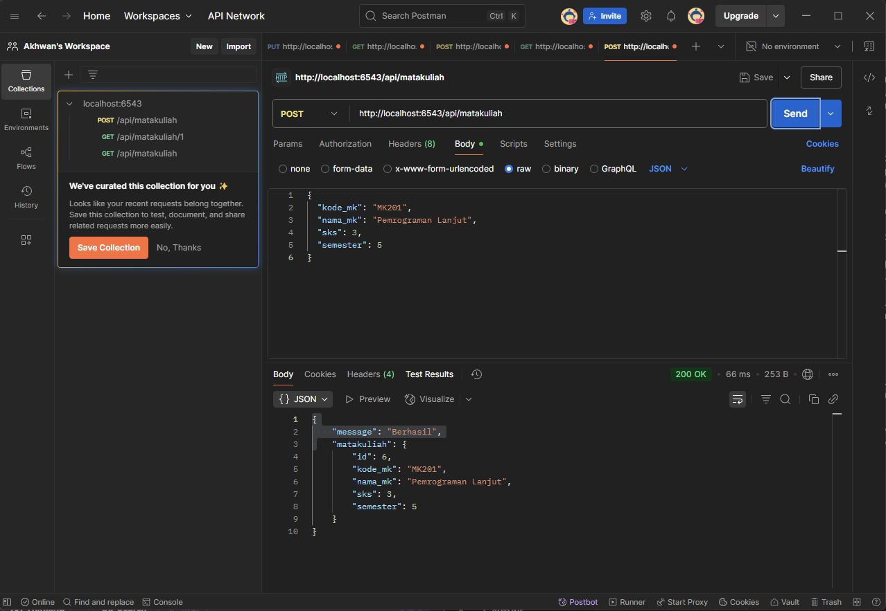
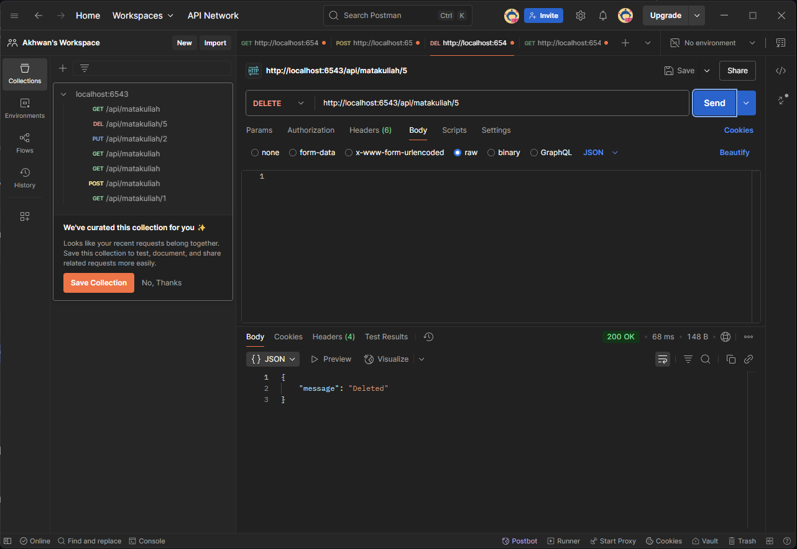

#  Aplikasi Manajemen Matakuliah – Pyramid RESTful API
---

## 💠 Fitur Utama

* ✅ Tambah matakuliah (POST)
* ✅ Ambil semua matakuliah (GET)
* ✅ Ambil matakuliah berdasarkan ID (GET)
* ✅ Update matakuliah (PUT)
* ✅ Hapus matakuliah (DELETE)

---

## Konfigurasi Database

Pastikan file `development.ini` memiliki konfigurasi berikut:

```ini
sqlalchemy.url = postgresql://pyramid_user(ini perlu diganti):pyramid_pass(perlu diganti)@localhost:5432/pyramid_matakuliah
```

---

## Cara Menjalankan Aplikasi

1. Aktifkan virtual environment:

```bash
.\venv\Scripts\activate
```

2. Jalankan migrasi database:

```bash
alembic -c development.ini upgrade head
```

3. Jalankan server:

```bash
pserve development.ini --reload
```

Akses API di: [http://localhost:6543/api/matakuliah](http://localhost:6543/api/matakuliah)

---
## Testing API via localhost

Screenshot:


---

## 🔍 Testing API via Postman

### 🔹 GET semua matakuliah

Screenshot:


---

### 🔹 POST matakuliah

Screenshot:



---

### 🔹 GET matakuliah berdasarkan ID

📸 Screenshot:


---

### 🔹 PUT update matakuliah

Screenshot:


---

### 🔹 DELETE matakuliah

Screenshot:



---
